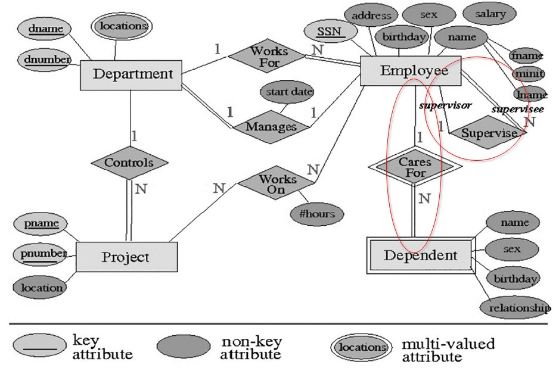
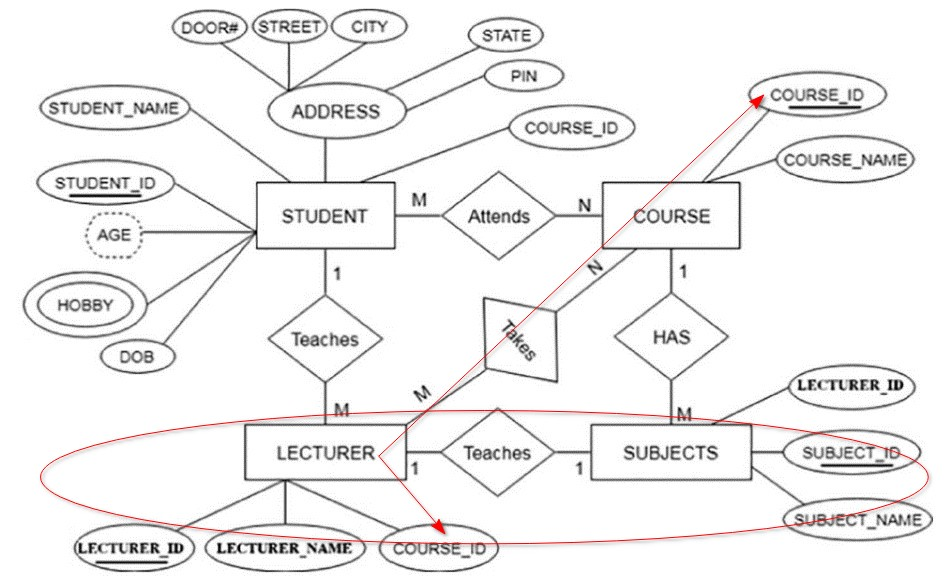

## [Tópico 02] - Exercícios de revisão (1/2)
###### *by Prof. Plinio Sa Leitao-Junior (INF/UFG)*

#### <ins>EXERCÍCIO:</ins> Qual a distinção entre ?
1. **Esquema Conceitual, Esquema Lógico e Esquema Físico:**
  > - **Esquema Conceitual:** É uma representação de alto nível de como os dados devem ser organizados, sem se preocupar com detalhes técnicos.
  > - **Esquema Lógico:** É uma representação intermediária que descreve as tabelas e relacionamentos entre elas, mas sem pensar considerações físicas.
  > - **Esquema Físico:** É a implementação real do banco de dados, incluindo como os dados são armazenados em discos e otimizados.

2. **Requisitos de Software e Requisitos de Dados:**
  > - **Requisitos de Software:** São as especificações que descrevem como o software deve funcionar, incluindo suas funcionalidades, interface do usuário, desempenho, segurança e outros aspectos comportamentais.
  > - **Requisitos de Dados:** São os requisitos que descrevem como os dados devem ser armazenados, processados e acessados pelo software.

3. **Independência Lógica e Independência Física:**
  > - **Independência Lógica:** Significa que você pode mudar a estrutura dos dados sem afetar os programas ou esquemas externos (visão do usuário).
  > - **Independência Física:** Significa que você pode mudar onde e como os dados são armazenados sem afetar os programas ou esquemas externos (visão do usuário).

4. **Dado e Metadado:**
  > - **Dado:** São informações brutas ou fatos que podem ser armazenados e processados, ou seja, são as informações do mundo real a serem armazenadas no banco de dados.
  > - **Metadado:** É a informação sobre os dados, como uma descrição do que os dados representam ,ou seja, são dados que descrevem outros dados. Eles podem descrever a estrutura, o formato e o significado dos dados.

5. **Definição, Construção e Manipulação de Banco de Dados:**
  > - **Definição de Banco de Dados:** É uma coleção de dados relacionados. || É o processo de estabelecer, por meio de metadados, a estrutura do banco de dados, incluindo restrições, tabelas, relacionamentos etc.
  > - **Construção de Banco de Dados:** É a criação real do banco de dados com tabelas e estruturas. || É a carga inicial do banco de dados, isto é, a criação das tabelas com a primeira instância de dados.
  > - **Manipulação de Banco de Dados:** São operações como adicionar, buscar ou atualizar dados no banco de dados. 

6. **Banco de Dados e Sistema Gerenciador de Banco de Dados (SGBD):**
  > - **Banco de Dados:** É onde as informações são armazenadas. || É um conjunto organizado de informações do mundo real associadas entre si, que são manipuláveis pelo sistema, mantidas durante um tempo e utilizadas para algum propósito específico 
  > - **SGBD:** É o software que ajuda a criar, acessar e gerenciar o banco de dados. || É o software responsável por fornecer as ferramentas para gerenciar um banco de dados, incluindo a definição, criação e manipulação dos dados armazenados.

7. **Tipo de Dado e Restrição de Integridade:**
  > - **Tipo de Dado:** É o formato dos dados, como números, palavras ou datas.
  > - **Restrição de Integridade:** São regras para garantir que os dados sejam precisos e consistentes.

8. **Modelo de Dados e Esquema de Banco de Dados:**
  > - **Modelo de Dados:** É uma maneira de descrever a estrutura de um banco de dados, relacionamentos de dados, semântica de dados e restrições de consistência. 
  > - **Esquema de Banco de Dados:** É a estrutura real do banco de dados, com tabelas, colunas e chaves, seguindo o modelo de dados escolhido.

9. **Redundância e Redundância Controlada:**
  > - **Redundância:** É a repetição desnecessária de dados no banco de dados, o que pode levar a problemas de consistência e ocupação de espaço.
  > - **Redundância Controlada:** É a redundância que é usada intencionalmente para melhorar o desempenho ou a recuperação de dados, mas é gerenciada e mantida de forma controlada para evitar inconsistências.

10. **Modelo Entidade-Relacionamento e Modelo Relacional:**
  > - **Modelo Entidade-Relacionamento (MER):** É um modelo que descreve a estrutura de dados em termos de entidades, atributos e relacionamentos entre entidades. É usado para projetar a estrutura conceitual de um banco de dados.
  > - **Modelo Relacional:** É um modelo que representa os dados em tabelas relacionadas, onde as tabelas têm colunas (atributos) e linhas (registros). É usado para implementar bancos de dados relacionais e é mais próximo da implementação física.

#### <ins>EXERCÍCIO:</ins> Quais as possíveis inconsistências no diagrama abaixo ?

>1. Não há controle de segurança para a informação de quantas horas foram realmente trabalhas no projeto.
>2. Não está claro se um dependente é obrigatoriamente um parente do seu empregado responsável
>3. Não está claro quantos supervisores podem pertencer à quantidade de departamentos ou se o supervisor está só relacionado para a quantidade de funcionários.
>4.  Numero de CPF não está com exclusividade.
>5. Não há muitas informações sobre o que realmente é um local.

#### <ins>EXERCÍCIO:</ins> Quais as possíveis inconsistências no diagrama abaixo ?

>1. Inconsistência entre SUBJECTS e LECTURER com Identificações Pessoais para Relacionamento de Um para Um
>2. A Relação do LECTURER com o COURSE, que é às Vezes Um para Um e Outras Vezes Um para Muitos

#### <ins>EXERCÍCIO:</ins> Que esquema conceitual de banco de dados, o MER, pode ser empregado para suportar consultas por quaisquer parentes de determinada pessoa ?

> Pode-se utilizar um Modelo de Entidade-Relacionamento (MER) que inclua uma entidade "Pessoa" e uma relação "Parentesco". Para suportar consultas por quaisquer parentes de determinada pessoa em um esquema conceitual de banco de dados.
Pessoa (Pai) <autorrelacionamento> Pessoa (Filho) |
Pessoa (Mãe) <autorrelacionamento> Pessoa (Filho)

#### <ins>EXERCÍCIO:</ins> Por que a <ins>ordenação de _tuplas_</ins> não é relevante no contexto do <ins>modelo relacional</ins> ?

> Uma tupla representa uma linha de uma tabela, isto é, uma instância de uma entidade. As relações, por sua vez, são formadas por um conjunto de tuplas, e, matematicamente falando, os elementos de um conjunto não possuem ordem entre eles. Além disso, o modelo relacional não se preocupa com o armazenamento físico dos dados (onde existe uma ordem de armazenamento na memória), apenas tenta representar os dados de forma lógica e abstrata.

#### <ins>EXERCÍCIO:</ins> O que significa <ins>valor nulo</ins> no jargão de banco de dados ? Quais as semelhanças e distinções entre ?
- Valor nulo e valor ausente.
- Valor nulo e informação.

> **Valor Nulo no Jargão de Banco de Dados:**
>- **Significado:** Em banco de dados, "valor nulo" representa a ausência de um valor válido em uma coluna, por diversas razões (não informado, não se aplica…).

>**Semelhanças e Distinções entre Valor Nulo, Valor Ausente e Informação:**
>1. **Valor Nulo e Valor Ausente:**
>   - **Semelhanças:** Ambos indicam a falta de um valor válido em um campo de dados.
>   - **Distinções:** "Valor nulo" é usado especificamente em bancos de dados, enquanto "valor ausente" é um termo mais genérico.
>2. **Valor Nulo e Informação:**
>   - **Semelhanças:** Ambos estão relacionados à presença ou ausência de dados.
>   - **Distinções:** "Valor nulo" é uma representação técnica em bancos de dados, enquanto "informação" refere-se ao conceito mais amplo de dados ou conhecimento.

#### <ins>EXERCÍCIO:</ins> No contexto do modelo relacional, qual a distinção entre os conceitos:

>1. **Restrição de Integridade de Chave, Restrição de Integridade de Entidade, Restrição de Integridade de Domínio e Restrição de Integridade Referencial:**
>   - **Restrição de Integridade de Chave:** Garante que os valores em uma coluna (ou conjunto de colunas) sejam únicos e não nulos, identificando exclusivamente cada tupla em uma tabela.
 >  - **Restrição de Integridade de Entidade:** Assegura que cada tupla em uma tabela seja única, com base em todas as suas colunas, não permitindo duplicatas.
>   - **Restrição de Integridade de Domínio:** Verifica se os valores em uma coluna estão dentro de um conjunto válido de valores, definidos pelo domínio da coluna.
>   - **Restrição de Integridade Referencial:** Mantém a consistência das relações entre tabelas, garantindo que os valores em uma coluna que faz referência a outra tabela correspondam a valores na tabela referenciada.

>2. **Superchave, Chave Candidata, Chave Primária e Chave Estrangeira:**
>   - **Superchave:** É um conjunto de uma ou mais colunas que podem ser usadas para identificar exclusivamente uma tupla em uma tabela, mas não necessariamente de forma mínima.
>   - **Chave Candidata:** É uma superchave mínima, ou seja, um conjunto de colunas que identifica exclusivamente uma tupla e não pode ser reduzido sem perder essa capacidade de identificação.
>   - **Chave Primária:** É uma chave candidata escolhida como a principal chave de identificação para uma tabela. Deve ser única e não nula para cada tupla na tabela.
>   - **Chave Estrangeira:** É uma coluna ou conjunto de colunas em uma tabela que faz referência à chave primária de outra tabela, estabelecendo uma relação entre as duas tabelas.

>3. **Distintos Valores que um Atributo Pode Ter e Número Total de Distintos Valores que um Atributo Pode Ter:**
>   - **Distintos Valores que um Atributo Pode Ter:** Refere-se ao número de valores únicos ou diferentes que um atributo específico possui em um conjunto de dados.
>   - **Número Total de Distintos Valores que um Atributo Pode Ter:** Refere-se ao limite máximo de valores únicos que um atributo pode conter com base em seu domínio e tipo de dados, independentemente dos valores reais presentes nos dados. Isso é determinado pelas propriedades do domínio do atributo.

#### <ins>EXERCÍCIO:</ins> No contexto do modelo relacional, analisar as sentenças:
>1. **Um banco de dados é tipicamente composto por várias relações:** 
>   Em um banco de dados relacional, os dados são organizados em tabelas (relações), e um banco de dados normalmente consiste em várias dessas tabelas.

>2. **Em geral, cada tupla de um banco de dados se relaciona com uma ou mais tuplas (via a associação entre chave estrangeira e chave primária):** 
>   A relação entre tabelas em um banco de dados relacional é estabelecida por meio de chaves estrangeiras e chaves primárias. Isso permite que uma tupla em uma tabela se relacione com uma ou mais tuplas em outra tabela.

#### <ins>EXERCÍCIO:</ins> No contexto do modelo relacional, que conceito se refere em ?

>1. **Conjunto de Esquemas de Relação: { R1, R2, ..., Rm }**:
>   - Refere-se a um conjunto de definições de tabelas ou relações.

>2. **Conjunto de Relações: { r1(R1), r2(R2), ..., rm(Rm) }**:
>   - Representa um conjunto de tabelas, cada uma seguindo um esquema de relação específico.

>3. **R(A1, A2, ..., An)**:
>   - É a definição de um esquema de relação com atributos (colunas) específicos.

>4. **Conjunto de n-tuplas: { t1, t2, ..., tm }**:
>   - Refere-se a um conjunto de registros individuais em uma relação.

>5. **Lista Ordenada de n Valores: <v1, v2, ..., vn>**:
>   - É uma lista ordenada de valores, correspondendo aos atributos em uma tupla específica.

#### <ins>EXERCÍCIO:</ins> Qualquer relação é um <ins>subconjunto</ins> do <ins>produto cartesiano</ins> entre os <ins>conjuntos de domínios</ins> dos atributos da relação ?
- Se R(A1, A2, ...,An), então
- r(R) ⊆ ( dom(A1) × dom(A2) × ... × dom(An) ) ?

> Sim, pois o produto cartesiano dos conjuntos de domínios dos atributos é o conjunto de todas as combinações possíveis de valores que podem ser atribuídos a cada atributo. A relação contém apenas um subconjunto dessas combinações, ou seja, apenas as tuplas que realmente existem na relação.

